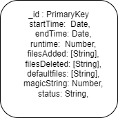

# Express.js Application with MongoDB

## Installation

1. Clone the repository:

   ```bash
   git clone <repository-url>
   ```

2. Install dependencies:

   ```bash
   npm install
   ```

## Configuration

Before running the application, you need to configure the MongoDB connection.

1. Set up your MongoDB connection string in your environment variables.

   ```bash
   DATABASE_URL=mongodb://localhost:27017/mydatabase
   ```

## Usage

Start the application:

```bash
npm start
```

### Import postman collection you can find in root path

```bash
api.json
```

<div align="center">
  
</div>
